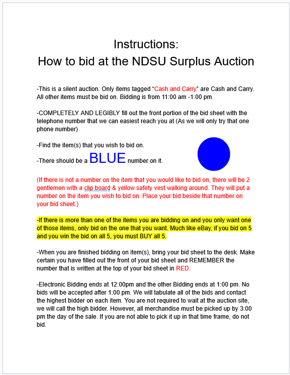
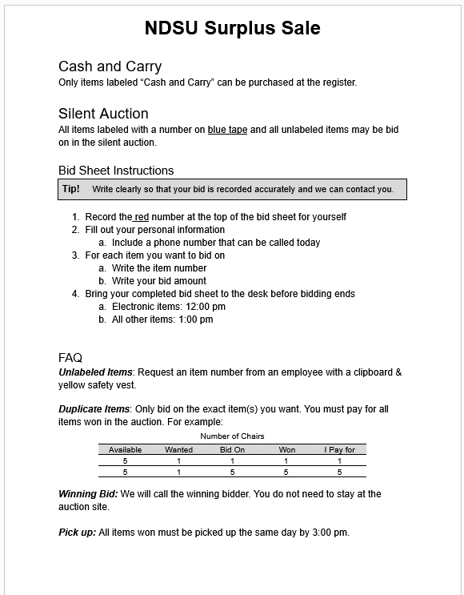

# College Surplus Sale 

## Introduction 

When I arrived to my local college's surplus sale shortly after they opened, I didn't see any instructions or signs to indicate how the sale was setup or how it worked. After wandering around the warehouse to get my bearings I had made the following observations: 

* There are 3 tables being staffed by employees and two people wearing high visability vests and carrying clip boards
* Some shelving racks have a sign indicating the items must be bid on, but most items don't have bid numbers
* Some items do not have any signage, bid numbers, or price tags 

The first table had two employees with a laptop and people lined up with bid sheets. The second table was a standard cash register. And the last table was on a raised platform and seemed to be an observation point for loss prevention. 

It was at the second table, the cash register, where I found the following instruction sheet. 

## Analysis 

### Positive Attributes 
1. Color plays a central role 
1. Descriptive instructions 
1. Each bullet/paragraph stands alone 

### Areas for Improvement 
1. Clarify separation of bidding vs. purchasing
1. Add structure to clearly indicate actions needed to complete bid 
1. Clarify what a "blue number" means

1. Increase inclusivness by removing unnecessary gender description 

1. Move special instructions to optomize flow and callouts 
  
1. Eliminate timing contradiction between the first and last paragraphs
1. Reduce word count and sentence length 
1. Increase accessibility by reducing reliance on color 

## Results 

| | Original | Modified | Percent Decrease |
| -------| :-------: | :----:| :-----:|
| Word Count | 323 | 218 | 32% |
| Characters (w/o spaces) | 1240 | 902 | 27% |
| Avg Sentence Length | 15.3 | 9.6 | 37% | 
